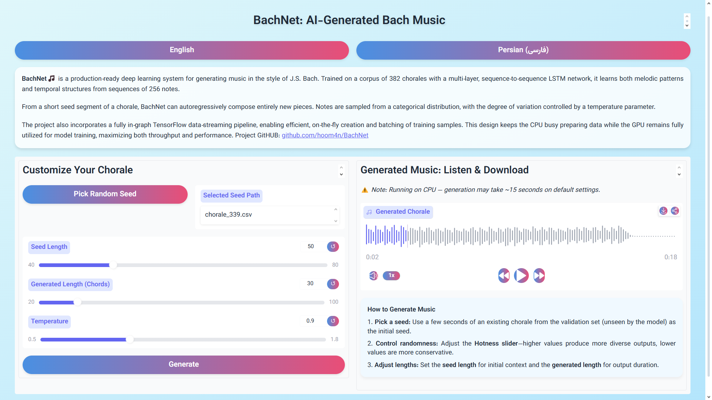
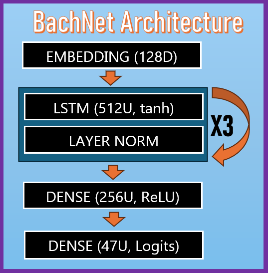

## 🎵 BachNet: AI-Generated Bach-Style Music 🎼


BachNet is a production‑ready Deep Learning system for generating music in the style of J.S. Bach. Trained on a corpus of 382 chorales with a multi‑layer, sequence‑to‑sequence LSTM network, it learns both melodic patterns and temporal structures from sequences of 256 notes.

From a short seed segment of a chorale, BachNet can autoregressively compose entirely new pieces. Notes are sampled from a categorical distribution, with the degree of variation controlled by a temperature parameter.

The architecture integrates embeddings, stacked LSTM building blocks with dropout and normalization, and optional dense layers for richer representations. Training is guided by a custom perplexity metric, adaptive learning‑rate scheduling, and early stopping, ensuring stable convergence and interpretable evaluation. The project also incorporates a fully in‑graph TensorFlow data‑streaming pipeline, enabling efficient, on‑the‑fly creation and batching of training samples.

🌐 Try Online Demo on HuggingFace 🤗: <a href="https://hoom4n-bachnet.hf.space/">https://hoom4n-bachnet.hf.space/</a><br/><br/>

<p align="center">
  
</p>

## ⚙️ Installation
### 🐳 Docker
```bash
# Clone repo
git clone https://github.com/hoom4n/BachNet.git
cd BachNet

# Build image
docker build -t bachnet .

# Run container
docker run -p 7860:7860 bachnet
```
### 💻 Local
```bash
# Clone repo
git clone https://github.com/hoom4n/BachNet.git
cd BachNet

# Create & activate venv
python3 -m venv bachnet
source bachnet/bin/activate

# Install Python deps
pip install -r requirements.txt

# Install FluidSynth (Ubuntu)
sudo apt-get update && sudo apt-get install -y fluidsynth

# Run app
python app.py
```

## 🧩 Technical Details

### 📂 Dataset:
The system is trained on 382 J.S. Bach chorales, each represented as sequences of four‑voice chords. Across the corpus there are 46 unique notes plus a silence token (47 symbols total). Each chorale is flattened into a 1‑D token sequence, from which overlapping windows of 256 notes are extracted. This window size enables the model to capture long‑range melodic and harmonic dependencies. The target for training is simply the input sequence shifted by one step, yielding about 260,000 input–target pairs in total.

A fully in‑graph TensorFlow data pipeline handles preprocessing and streaming. Chorales are read from disk, tokenized, segmented into windows, and encoded into integer IDs. Batches of 256 samples are then created, with prefetching and caching ensuring that the CPU continuously prepares data while the GPU remains fully utilized. This design minimizes I/O overhead and maximizes throughput during training.


## 🏗️ Model Architecture

<table>
<tr>
<td width="60%">

The network begins with an embedding layer of size 128, which maps each of the 47 unique note tokens (including silence) into a dense, continuous representation. This is followed by a stack of three LSTM blocks, each with 512 hidden units, input dropout, and layer normalization. LSTMs were chosen over GRUs for their additional gating mechanisms, which are better suited to modeling the long‑term melodic and harmonic dependencies characteristic of Bach’s style. Layer normalization further stabilizes training by controlling gradient and activation variance across time steps.

On top of the recurrent stack, a 256‑unit ReLU feed‑forward layer projects the learned temporal features into a richer latent space, improving the model’s ability to capture nonlinear harmonic relationships. Finally, a dense output layer produces logits over the 47‑token vocabulary, enabling categorical sampling during generation.

</td>
<td width="40%">



</td>
</tr>
</table>


### 📈 Training Setup

| Component        | Details                                                                 |
|------------------|-------------------------------------------------------------------------|
| **Framework**    | Keras (TF backend) for Modeling & Evaluation; TensorFlow Data for Pipeline|
| **Optimizer**    | Nadam (Nesterov‑accelerated Adam) with Gradient Clipping                |
| **Learning Rate**| 1e‑3 with Exponential Decay: $lr \times 0.1^{\tfrac{\text{epoch}}{s}}$  |
| **Regularizers** | L2, Weight Decay, , Dropout, Early Stopping                             |
| **Loss**         | Cross Entropy                                                           |
| **Metrics**      | Accuracy, Perplexity (Exponentiated Cross‑Entropy)                      |
| **Num of Epochs**| 5, Triggered by Early Stopping                                          |
| **Batch Size**   | 256                                                                     |
| **Callbacks**    | ModelCheckpoint, EarlyStopping, LearningRateScheduler                   |

## 🎶 Inference

To generate new music, the process begins by **sampling the next note** from the model’s output distribution. This is done with `predict_next_token`, which takes the current context, scales the logits by a chosen **temperature** (to control creativity), and samples the next token.  

Building on this, `generate_sequence` repeatedly applies this step in an **autoregressive loop**, appending each newly predicted token back into the context. In this way, a short seed sequence can be extended into a much longer continuation, capturing Bach‑style harmonic and melodic flow.  

Finally, `generate_chorale` wraps the entire process: it selects a seed sequence (optionally using `draw_random_sample`), generates a continuation, converts the resulting tokens back into four‑voice chords, and saves the output as a **MIDI file**.

Example usage:

```python
from src.inference import generate_chorale, draw_random_sample
# pick a random seed from dataset
seed_path = draw_random_sample("data/jsb_chorales_extracted/jsb_chorales/val")

# generate and save a chorale
generate_chorale(
    model, 
    sample_seed_path=seed_path, 
    note2id=note2id, 
    id2note=id2note, 
    file_name="samples/chorale.mid",
    max_len=25, 
    temperature=0.9,
    include_init_context=False
)
```

